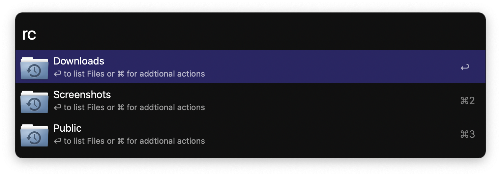

# Recent Files In Folders

Alfred Workflow to list recent files in folders, newest on top.

## NOTE

**With version 4.0 the configuration was integrated in the Workflow from List Filter. After the upgrade it is required to setup the Folder from scratch!**
**Please ensure to write down (or Screenshot) your current configuration.**

## Usage

1. After the workflow was installed you need to add folders first:
   1. Search for a folder via Alfred
   2. Press `TAB` to enter file action
      1. The `TAB` shortcut is maybe configured differently under
          `Alfred Preferences` → `Features` → `Universal Action` → `Show Actions`
   3. Search for `Add Folder to Recent Folders` and execute
2. Type `rc` to start Recent Folders Workflow and subsequently the folders will be listed
3. Press `CMD` to enter addtional actions:
   1. Back to list of folders
   2. Purge Directory to delete all files and folders
   3. Delete folder from configuration
4. Press `ENTER` to open the underlying file
5. Press `CMD` to reveal in Finder
6. Press `Tab` to enter File action on selected file

## Advance Configuration

* A Custom string format can be set in *date_format* workflow value (Format cheat sheet: http://strftime.org/)
* If `search_subfolders` is set to `True` the subfolders in the directory will be read as well. If set to `False` Subfolders will be ignored.
* To restrict search to certain filetypes add a comma separated list of extensions to `ext_comma_sep` e.g. `jpg,png` will only search for jpg and png files. 

## Screenshot

